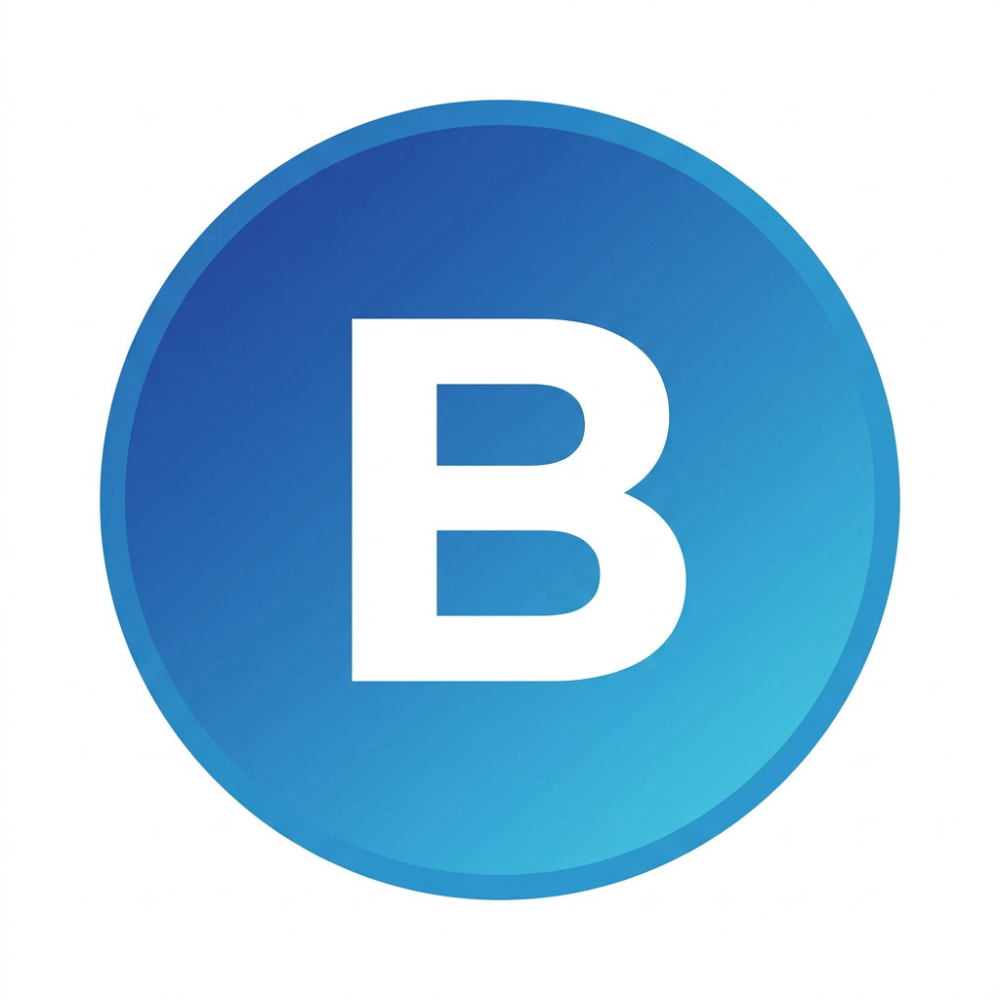

# ByAzenB Browser — Десктопный браузер на Electron

Полноценный кроссплатформенный браузер для Windows, macOS, Linux с вкладками, историей, закладками, загрузками, инкогнито, DevTools.



## 1. Выбор технологии и обоснование

### Выбранный стек: **Electron + Chromium + Node.js**

**Почему Electron, а не альтернативы:**

| Критерий | Electron | Tauri | CEF | Qt WebEngine / PyQt |
|---|---|---|---|---|
| Движок | Chromium (последний) | OS WebView (разный на Win/Mac/Linux) | Chromium | Chromium (устаревший) |
| Совместимость сайтов | 100% | 90% (различия WebView) | 100% | 95% |
| Язык разработки | JS/HTML/CSS | Rust + JS | C++ | Python/C++ |
| Сложность | Низкая | Средняя | Высокая | Средняя |
| Упаковка | electron-builder в 1 команду | сложно | очень сложно | PyInstaller глючит |
| API браузера | Полный (tabs, session, downloads, DevTools) | Ограничен | Нужно писать самому | Ограничен |

**Вывод:** Для задачи "сделать свой браузер быстро и чтобы всё работало" — Electron лучший. Это то, на чем сделаны VS Code, Discord, Slack, Opera, Arc.

### Используемые библиотеки с GitHub

1. **electron/electron**
   - Ссылка: https://github.com/electron/electron
   - Лицензия: MIT
   - Назначение: основа браузера, предоставляет Chromium + Node.js + API для вкладок (WebContentsView), сессий, загрузок, меню
   - Подключение: `npm install electron --save-dev`

2. **electron-userland/electron-builder**
   - Ссылка: https://github.com/electron-userland/electron-builder
   - Лицензия: MIT
   - Назначение: сборка в .exe / .dmg / .AppImage
   - Подключение: `npm install electron-builder --save-dev`

Других внешних зависимостей нет — хранилище реализовано на чистом JSON (fs), чтобы не тянуть лишнего.

## 2. Архитектура проекта

```
ByAzenB/
├── main.js           # Main процесс: управление окнами, вкладками, сессиями, IPC
├── preload.js        # Мост безопасности между main и renderer (contextBridge)
├── package.json      # Зависимости и скрипты сборки
├── assets/
│   └── icon.png      # Иконка приложения
└── renderer/
    ├── index.html    # UI: вкладки, омнибокс, закладки, внутренние страницы
    ├── style.css     # Тема светлая/темная, современный дизайн Chrome-like
    └── renderer.js   # Логика UI, IPC вызовы, рендер истории/закладок/загрузок
```

**Как работают вкладки:**
Используется современный API `WebContentsView` (замена устаревшему BrowserView). Каждая вкладка = отдельный WebContentsView со своей сессией. При переключении вкладки view переставляется в окно и ресайзится под тулбар.

**Приватность:**
- Обычные вкладки: `session.defaultSession` — сохраняет куки, историю
- Инкогнито: `session.fromPartition('incognito', {cache:false})` — всё в памяти, не пишет на диск

## 3. Реализованные функции (ТЗ)

- [x] **Вкладки**: создание, закрытие, переключение, дублирование, средняя кнопка мыши, favicon, title
- [x] **Адресная строка (Omnibox)**: умный ввод — если URL, открывает URL, если текст — поиск в выбранном поисковике
- [x] **Навигация**: назад, вперед, обновить, стоп, домой, индикатор загрузки
- [x] **Меню**: File/Edit/View/History/Bookmarks/Settings + контекстное меню страницы + бургер-меню
- [x] **Закладки**: добавление звездой, панель закладок, страница управления, контекстное меню удаления
- [x] **История**: сохранение в `%APPDATA%/ByAzenB/history.json`, группировка по дате, поиск, удаление, очистка
- [x] **Загрузки**: перехват `will-download`, прогресс, открытие файла/папки, история в `downloads.json`
- [x] **Настройки**: домашняя страница, поисковая система (Google/DuckDuckGo/Bing/Yandex/Brave), папка загрузок, темная тема, базовая блокировка рекламы, горячие клавиши
- [x] **Инкогнито**: отдельное окно с фиолетовым акцентом, изолированная сессия, бейдж 🕶️
- [x] **DevTools**: Ctrl+Shift+I на вкладку, просмотр кода, контекстное меню
- [x] **Дополнительно**: поиск на странице (Ctrl+F), зум (Ctrl +/-), новая вкладка с быстрым доступом

## 4. Установка и запуск

### Требования
- Node.js 18+ https://nodejs.org
- npm 9+
- Windows 10+/macOS 12+/Linux Ubuntu 20.04+

### Команды

```bash
# Клонировать
git clone https://github.com/gggvkvh405-rgb/ByAzenB.git
cd ByAzenB

# Установить зависимости (скачает Electron ~200MB)
npm install

# Запустить в dev режиме
npm run dev
# или
npm start

# Собрать бинарник для текущей ОС
npm run build

# Собрать под конкретную ОС
npm run build:win    # -> dist/ByAzenB Browser Setup.exe
npm run build:mac    # -> dist/ByAzenB Browser.dmg
npm run build:linux  # -> dist/ByAzenB Browser.AppImage
```

Собранные файлы будут в папке `dist/`.

### Где хранятся данные
- Windows: `%APPDATA%\byazenb-browser\`
- macOS: `~/Library/Application Support/byazenb-browser/`
- Linux: `~/.config/byazenb-browser/`

Файлы: `history.json`, `bookmarks.json`, `settings.json`, `downloads.json`

## 5. План разработки (этапы)

**Этап 1 — MVP (уже готов):**
- Окно + WebContentsView
- Вкладки + адресная строка + навигация
- IPC мост

**Этап 2 — База браузера (готово):**
- История, закладки, загрузки (JSON Store)
- Меню, контекстное меню, DevTools
- Настройки, поисковая система

**Этап 3 — Продвинутые (готово в этом прототипе):**
- Инкогнито сессия
- Темная тема, блокировка рекламы (webRequest)
- Find in page, zoom, новая вкладка с шорткатами
- Горячие клавиши

**Этап 4 — Что можно добавить дальше:**
- Расширения (chrome extensions API через `session.loadExtension`)
- AdBlock на основе `electron-better-adblock` https://github.com/AdguardTeam/electron-better-adblock (MPL-2.0)
- Пароли: `keytar` https://github.com/atom/node-keytar (MIT)
- Автообновление: `electron-updater`
- Встроенный VPN/Proxy настройки через `session.setProxy`
- Скриншоты, PDF печать, кастомные протоколы

## 6. Код — ключевые моменты

**Создание вкладки (main.js):**
```js
const view = new WebContentsView({
  webPreferences: { session: ses, sandbox: true, contextIsolation: true }
});
view.webContents.loadURL(url);
mainWindow.contentView.addChildView(view);
```

**Умный омнибокс:**
```js
function resolveInputToUrl(input) {
  if (input.startsWith('http')) return input;
  if (input.includes('.') && !input.includes(' ')) return 'https://' + input;
  return searchEngine.replace('%s', encodeURIComponent(input));
}
```

**Инкогнито:**
```js
session.fromPartition(`incognito-${id}`, {cache:false})
```

## 7. Лицензия
MIT — можешь использовать, форкать, продавать.

## 8. Автор
ByAzenB Team — браузер сделан на Arena.ai Agent Mode.
